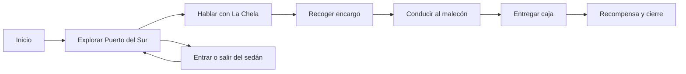

# Arquitectura técnica — Ciudad del Lago

## Principios

La implementación usa Godot 4 y GDScript. La jugabilidad vive en componentes pequeños y reutilizables; las escenas sólo componen nodos, recursos y referencias. Las entradas se definen por acciones para que teclado, mando y HUD táctil activen las mismas órdenes sin duplicar lógica.

| Ruta | Responsabilidad |
|---|---|
| `escenas/Main.tscn` | Arranque, iluminación, distrito, HUD y orquestación de la partida |
| `escenas/Player.tscn` | Personaje controlable, colisiones y punto de cámara |
| `escenas/Vehicles/Sedan.tscn` | Vehículo original, cuerpo físico, ruedas visuales y punto de entrada |
| `escenas/ui/MobileHUD.tscn` | Botones táctiles, indicadores de misión y mensajes contextuales |
| `scripts/core/GameState.gd` | Estado de partida, monedas, vehículo activo y señales globales |
| `scripts/player/PlayerController.gd` | Movimiento a pie, gravedad, salto e interacción |
| `scripts/player/ThirdPersonCamera.gd` | Cámara orbital, suavizado, límites y oclusión |
| `scripts/vehicles/ArcadeVehicle.gd` | Aceleración, frenado, dirección, estabilidad y entrada/salida |
| `scripts/missions/MissionController.gd` | Máquina de estados de objetivos, marcadores y recompensas |
| `scripts/world/DistrictBuilder.gd` | Construcción modular de calles, edificios, faroles y puntos de misión |
| `scripts/ui/MobileHUD.gd` | Adaptación de eventos de UI a acciones de juego y avisos de estado |
| `assets/models/` | GLB únicamente con licencia revisada, importados como recursos locales |
| `assets/audio/` | Sonidos originales o con licencia compatible y fichero de atribuciones |
| `docs/` | Guías, licencias de assets y decisiones de diseño |

## Flujo de juego

## Contratos de sistemas

| Sistema | Entrada | Salida o señal |
|---|---|---|
| `PlayerController` | `move_*`, `jump`, `interact` | `interaction_requested`, posición y velocidad |
| `ArcadeVehicle` | `accelerate`, `brake`, `steer_*`, `exit_vehicle` | `driver_exited`, velocidad en km/h aproximada |
| `MissionController` | Interacciones y llegada a zonas | `objective_changed`, `mission_completed` |
| `GameState` | Señales de jugador, vehículo y misión | Estado consultable por HUD y guardado futuro |
| `MobileHUD` | Pulsaciones táctiles | Acciones de entrada presionadas/liberadas |

## Decisiones de rendimiento móvil

El distrito se compone de primitivas y materiales compartidos. Las zonas alejadas se atenúan con niebla y no se apoyan en sombras costosas. El juego utiliza una cámara única, luces directas limitadas y efectos de postprocesado discretos. Las texturas deben tener potencias de dos y tamaños contenidos; los modelos GLB se revisarán para evitar animaciones, materiales o mapas innecesarios.

## Extensibilidad prevista

Las misiones se expresarán como estados y zonas, no como secuencias rígidas. Esto permitirá añadir encargos de entrega, carreras o conversaciones cambiando datos y puntos de mundo. El vehículo expone parámetros de manejo para crear variantes sin duplicar código. El HUD recibe señales del estado global y no consulta nodos de escena por rutas frágiles.
